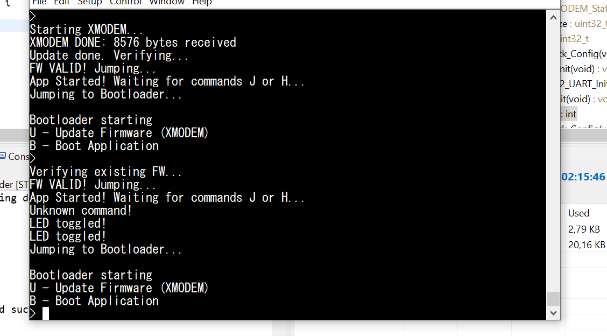

# STM32 Secure Bootloader with XMODEM + AES-CMAC

This project demonstrates a secure bootloader for the **STM32F411RE** that ensures firmware integrity and authenticity using **AES-CMAC cryptography**. Firmware updates are transmitted via **UART using XMODEM protocol**, allowing secure and reliable over-the-air updates (or via serial cable).

---

## 🗂️ Project Structure
CMAC_boot/
├── Application/ # application that we will flash it in MCU
├── Bootloader/ # who will update and check integrity and Auth
├── STM32_Cryptographic/ # AES-CMAC libraries (legacy + cmox)
├── tool/ # Python scripts for Add Tag (Key) in Firmware
└── CMAC.PNG # Screenshot of successful secure boot update
└──Output/ # .bin that generated by tool 

---

## ⚙️ Features

1. **Secure Firmware Updates**
   - Firmware is sent via **UART** using the **XMODEM protocol**.
   - Bootloader receives the firmware and stores it in Flash memory.

2. **Cryptographic Integrity**
   - Each firmware binary is signed using **AES-CMAC**.
   - On reception, the bootloader verifies the firmware using the embedded **CMAC key**.
   - Prevents corrupted or unauthorized firmware execution.

3. **Authenticity Check**
   - Only firmware signed with the correct key is accepted.
   - Failed authentication triggers an error message via UART and blocks execution.

4. **Ease of Use**
   - Simple UART commands:
     - `U` – Update firmware via XMODEM
     - `B` – Boot existing firmware

---

## 🛠️ Python Script for Firmware Signing

A Python script generates a **signed firmware** (`app_with_cmac.bin`):

- Adds **AES-CMAC tag** at the end of the firmware.
- Computes **firmware size** and **CMAC value** for verification.
- Ensures secure update flow from host PC to STM32.

Example output:




---

## 🔄 Bootloader Flow

1. Bootloader starts and sends prompt via UART:


2. User sends `U` to start firmware update.
3. **XMODEM protocol** receives firmware and writes to Flash.
4. Bootloader verifies **AES-CMAC** tag:
   - If **valid**, jumps to new firmware.
   - If **invalid**, rejects the firmware.

5. User can also send `J` to boot existing firmware, which is verified before execution.

---

## 🔑 Security Details

- **AES-CMAC Key**:

```c
const uint8_t FW_AES_KEY[16] = {
    0x12, 0x34, 0x56, 0x78,
    0x9A, 0xBC, 0xDE, 0xF0,
    0x11, 0x22, 0x33, 0x44,
    0x55, 0x66, 0x77, 0x88
};
